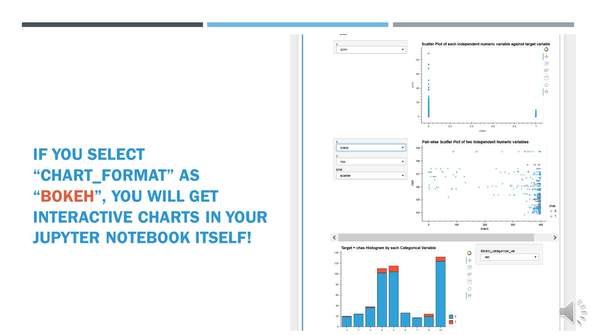
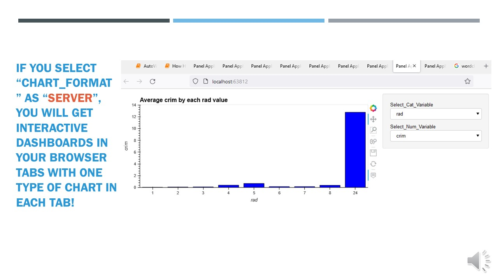

# AutoViz

Automatically Visualize any dataset, any size with a single line of code. Now you can save these interactive charts as HTML files automatically with the `"html"` setting.

```Alert! Starting with version 0.1.30, AutoViz has now moved to a containerized application that runs silently without displaying charts in verbose = 0 or verbose = 1 mode. If you are displaying charts in a Jupyter Notebook, you must use %matplotlib inline command to make charts visible. Please note this important change in behavior.```

See Colab notebook for example: [AutoViz Demo with HTML setting](https://colab.research.google.com/drive/1r5QqESRZDY98FFfDOgVtMAVA_oaGtqqx?usp=sharing)


[](https://pepy.tech/project/autoviz)
[](https://pepy.tech/project/autoviz)
[](https://pepy.tech/project/autoviz)
[](https://github.com/RichardLitt/standard-readme)
[](https://pypi.org/project/autoviz)
[](https://pypi.org/project/autoviz)
[](https://github.com/AutoViML/AutoViz/blob/master/LICENSE)

AutoViz performs automatic visualization of any dataset with one line of code.
Give it any input file (CSV, txt or json format) of any size and AutoViz will visualize it, provided you set the `max_rows_analyzed` and `max_cols_analyzed` setting within the bounds of your machine's memory limit. 

AutoViz can now create charts in multiple  formats using the `chart_format` setting:
- If `chart_format ='png'` or `'svg'` or `'jpg'`: Matplotlib charts are plotted inline.
    * Can be saved locally (using `verbose=2` setting) or displayed (`verbose=1`) in Jupyter Notebooks.
    * This is the default behavior for AutoViz.
- If `chart_format='bokeh'`: Interactive Bokeh charts are plotted in Jupyter Notebooks.
- If `chart_format='server'`, dashboards will pop up for each kind of chart on your browser.
- If `chart_format='html'`, interactive Bokeh charts will be created and silently saved as HTML files under the `AutoViz_Plots` directory (under working folder) or any other directory that you specify using the `save_plot_dir` setting (during input).

## Table of Contents

- [Install](#install)
- [Usage](#usage)
- [API](#api)
- [Maintainers](#maintainers)
- [Contributing](#contributing)
- [License](#license)

## Install

**Prerequsites**

- [Anaconda](https://docs.anaconda.com/anaconda/install/)

To clone AutoViz, it's better to create a new environment, and install the required dependencies:

To install from PyPi:

```sh
conda create -n <your_env_name> python=3.7 anaconda
conda activate <your_env_name> # ON WINDOWS: `source activate <your_env_name>`
pip install autoviz
```

To install from source:

```sh
cd <AutoViz_Destination>
git clone git@github.com:AutoViML/AutoViz.git
# or download and unzip https://github.com/AutoViML/AutoViz/archive/master.zip
conda create -n <your_env_name> python=3.7 anaconda
conda activate <your_env_name> # ON WINDOWS: `source activate <your_env_name>`
cd AutoViz
pip install -r requirements.txt
```

## Usage

Read this Medium article to know how to use [AutoViz](https://towardsdatascience.com/autoviz-a-new-tool-for-automated-visualization-ec9c1744a6ad).

In the AutoViz directory, open a Jupyter Notebook and use this line to instantiate the library

```py
from autoviz.AutoViz_Class import AutoViz_Class

AV = AutoViz_Class()
```

Load a dataset (any CSV or text file) into a Pandas dataframe or give the name of the path and filename you want to visualize.
If you don't have a filename, you can simply assign the filename argument `""` (empty string).

Call AutoViz using the filename (or dataframe) along with the separator and the name of the target variable in the input.

```py
filename = ""
sep = ","
dft = AV.AutoViz(
    filename,
    sep=",",
    depVar="",
    dfte=None,
    header=0,
    verbose=0,
    lowess=False,
    chart_format="svg",
    max_rows_analyzed=150000,
    max_cols_analyzed=30,
    save_plot_dir=None
)
```
AutoViz will do the rest. You will see charts and plots on your screen.


`AV.AutoViz` is the main plotting function in AV. Depending on what `chart_format` you choose, AutoViz will automatically call either the `AutoViz_Main` function or `AutoViz_Holo` function. 

**Notes:**

* AutoViz will visualize any sized file using a statistically valid sample.
* `COMMA` is assumed as default separator in file. But you can change it.
* Assumes first row as header in file but you can change it.
- `verbose` option
  - if 0, display minimal information but displays charts on your notebook
  - if 1, print extra information on the notebook and also display charts
  - if 2, will not display any charts, it will simply save them in your local machine under `AutoViz_Plots` directory under your current working folder.

- `chart_format` option
  - if `'svg','jpg' or 'png'`, displays all charts or saves them depending on verbose option.
  - if `'bokeh'`, plots interactive charts using Bokeh on your Jupyter Notebook
  - if `'server'`, will display charts on your browser with one chart type in each tab
  - if `'html'`, will create bokeh interactive charts and silently save them under `AutoViz_Plots` directory or any directory you specify in the `save_plot_dir` setting.



## API

**Arguments**

- `filename` - Make sure that you give filename as empty string ("") if there is no filename associated with this data and you want to use a dataframe, then use dfte to give the name of the dataframe. Otherwise, fill in the file name and leave dfte as empty string. Only one of these two is needed to load the data set.
- `sep` - this is the separator in the file. It can be comma, semi-colon or tab or any value that you see in your file that separates each column.
- `depVar` - target variable in your dataset. You can leave it as empty string if you don't have a target variable in your data.
- `dfte` - this is the input dataframe in case you want to load a pandas dataframe to plot charts. In that case, leave filename as an empty string.
- `header` - the row number of the header row in your file. If it is the first row, then this must be zero.
- `verbose` - it has 3 acceptable values: 0, 1 or 2. With zero, you get all charts but limited info. With 1 you get all charts and more info. With 2, you will not see any charts but they will be quietly generated and save in your local current directory under the AutoViz_Plots directory which will be created. Make sure you delete this folder periodically, otherwise, you will have lots of charts saved here if you used verbose=2 option a lot.
- `lowess` - this option is very nice for small datasets where you can see regression lines for each pair of continuous variable against the target variable. Don't use this for large data sets (that is over 100,000 rows)
- `chart_format` - this can be `'svg', 'png', 'jpg'` or `'bokeh'` or `'server'` or `'html'`. You will get charts generated (inline with `verbose=0` or `1` option). Instead you can silently save them in multiple formats if you used `verbose=2` option. The latter options are useful for interactive charts.
- `max_rows_analyzed` - limits the max number of rows that is used to display charts. If you have a very large data set with millions of rows, then use this option to limit the amount of time it takes to generate charts. We will take a statistically valid sample.
- `max_cols_analyzed` - limits the number of continuous vars that can be analyzed
- `save_plot_dir` - directory you want the plots to be saved. Default is None which means it is saved under the current directory under a sub-folder named `AutoViz_Plots`. If the `save_plot_dir` does not exist, it creates it.



## Maintainers

* [@AutoViML](https://github.com/AutoViML)
* [@morenoh149](https://github.com/morenoh149)
* [@hironroy](https://github.com/hironroy)

## Contributing

See [the contributing file](contributing.md)!

PRs accepted.

## License

Apache License, Version 2.0

## DISCLAIMER
This project is not an official Google project. It is not supported by Google and Google specifically disclaims all warranties as to its quality, merchantability, or fitness for a particular purpose.
