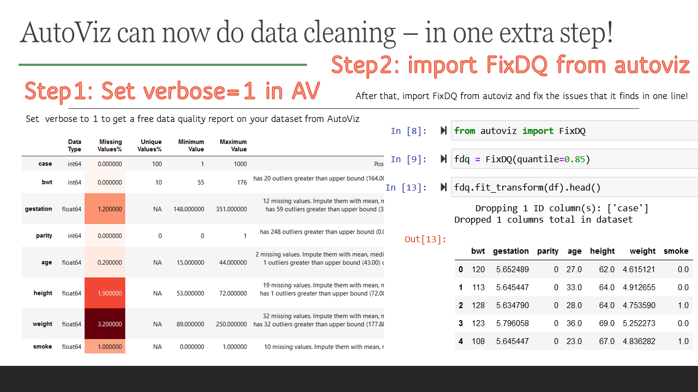

# Latest updates and news from AutoViz!

### April 2024: AutoViz version 0.1.900+ series has some fixes for autoviz install issues
You can always use pip install from git which uses the latest setup.py and it works well!
`!pip install git+https://github.com/AutoViML/AutoViz`

But if you are using `pip install autoviz`, then you will get two kinds of errors. In order to know what to do, perform the following steps.

**First print these 3 versions of pandas, numpy and holoviews**<br>
<code>
import pandas as pd<br>
import numpy as np<br>
import holoviews as hv<br>
print(pd.__version__, np.__version__,hv.__version__)
</code>

If it prints 
`numpy<1.24, pandas<2.0, holoviews <= 1.14.19`

These are all older versions of pandas and numpy along with older versions of holoviews<=1.14.9. These three older versions work together since holoviews uses an older syntax numpy (`np.bool`) that numpy<1.24 uses. However, if you are running this in kaggle kernels, you must restart your Kaggle kernel after you install autoviz since it changes the numpy and pandas versions to an older version and requires a restart to take effect. But if you get this error: `"ValueError: ClassSelector parameter None value must be an instance of (function, tuple), not <function size at 0x7c5f3e111770>."` In that case, you must upgrade holoviews to 1.16.0.

But if the above statements, print newer versions of pandas and numpy, like this:<br>
<code>
pandas>=2.0.0 numpy>=1.24.0 holoviews>=1.16.0 
</code>
then you need newer versions of holoviews. Although regular AutoViz works well with newer pandas and numpy the older holoviews version corrupts it. AutoViz_Holo needs newer versions such as holoviews>=1.16.0 in order to work with newer numpy and pandas. For example, if you don't upgrade holoviews to >=1.16.0 you will get this error: "ValueError: ClassSelector parameter None value must be an instance of (function, tuple), not <function size at 0x7c5f3e111770>."

Hope this is clear. Please let us know via the issues tab in GitHub.

### December 2023: AutoViz now has modular dependency loading and improved support for Python versions 3.10+
<li>Modular Dependency Loading: AutoViz now uses a more flexible approach for importing visualization libraries starting with version `0.1.801`. This means you only need to install certain dependencies (like hvplot and holoviews) if you plan to use specific backends (e.g., bokeh). This change significantly reduces installation issues for users on newer Python versions such as 3.10 and higher.</li>

<li>Improved Backend Support: Depending on your Python environment, AutoViz dynamically adjusts to use compatible visualization libraries, ensuring a smoother user experience. Requirements:
        "holoviews>=1.14.9",
        "bokeh>=2.4.2",
        "hvplot>=0.7.3",
        "panel>=0.12.6".
</li>

### June 2023: AutoViz now has Data Quality checks and a transformer to fix your data quality
From version 0.1.70, AutoViz can now automatically analyze your dataset and fix data quality issues in your data set. All you have to do is to `from autoviz import FixDQ ` and use it like a `fit_transform` transformer. It's that easy to perform data cleaning now with AutoViz!



### Apr-2023 Update: AutoViz now creates scatter plots for categorical variables when data contains only cat variables
From version 0.1.600 onwards, AutoViz now automatically draws `catscatter` plots for pairs of categorical variables in a data frame. A `catscatter` plot is a type of scatter plot that shows the frequency of each combination of categories in two variables. It can be useful for exploring the relationship between categorical variables and identifying patterns or outliers. It creates these plots only if the data contains no numeric variables. Otherwise, it doesn't create them since it would be unncessary.

```
AutoViz is grateful to the cascatter implementation of Myr Barnés, 2020.
You can see the original here: https://github.com/myrthings/catscatter/blob/master/catscatter.py
# More info about this function here:
# - https://towardsdatascience.com/visualize-categorical-relationships-with-catscatter-e60cdb164395
# - https://github.com/myrthings/catscatter/blob/master/README.md
```

### Sep-2022 Update: AutoViz now provides data cleansing suggestions! #autoviz #datacleaning
From version 0.1.50 onwards, AutoViz now automatically analyzes your dataset and provides suggestions for how to clean your  data set. It detects missing values, identifies rare categories, finds infinite values, detects mixed data types, and so much more. This will help you tremendously speed up your data cleaning activities. If you have suggestions to add more data cleaning steps please file an `Issue` in our GitHub and we will gladly consider it. Here is an example of how data cleaning suggestions look:<br>


In order to get this latest function, you must upgrade autoviz to the latest version by:
```
pip install autoviz --upgrade
```

In the same version, you can also get data suggestions by using `AV.AutoViz(......, verbose=1)` or by simply importing it:<br>

```
from autoviz import data_cleaning_suggestions
data_cleaning_suggestions(df)
```

### Dec-23-2021 Update: AutoViz now does Wordclouds! #autoviz #wordcloud
AutoViz can now create Wordclouds automatically for your NLP variables in data. It detects NLP variables automatically and creates wordclouds for them. See Colab notebook for example: [AutoViz Demo with HTML setting](https://colab.research.google.com/drive/1r5QqESRZDY98FFfDOgVtMAVA_oaGtqqx?usp=sharing)


### Dec 21, 2021: AutoViz now runs on Docker containers as part of MLOps pipelines. Check out Orchest.io
We are excited to announce that AutoViz and Deep_AutoViML are now available as containerized applications on Docker. This means that you can build data pipelines using a fantastic tool like [orchest.io](orchest.io) to build MLOps pipelines visually. Here are two sample pipelines we have created:

<b>AutoViz pipeline</b>: https://lnkd.in/g5uC-z66
<b>Deep_AutoViML pipeline</b>: https://lnkd.in/gdnWTqCG

You can find more examples and a wonderful video on [orchest's web site](https://github.com/orchest/orchest-examples)


### Dec-17-2021 AutoViz now uses HoloViews to display dashboards with Bokeh and save them as Dynamic HTML for web serving #HTML #Bokeh #Holoviews
Now you can use AutoViz to create Interactive Bokeh charts and dashboards (see below) either in Jupyter Notebooks or in the browser. Use chart_format as follows:
- `chart_format='bokeh'`: interactive Bokeh dashboards are plotted in Jupyter Notebooks.
- `chart_format='server'`, dashboards will pop up for each kind of chart on your web browser.
- `chart_format='html'`, interactive Bokeh charts will be silently saved as Dynamic HTML files under `AutoViz_Plots` directory
